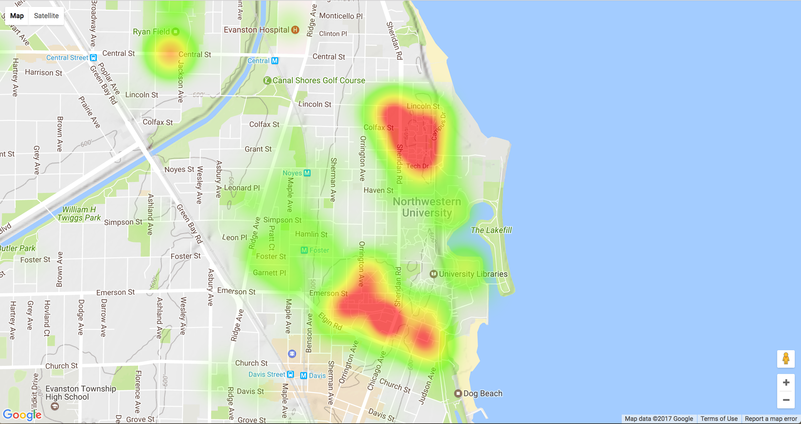

# Blotter
Blotter scrapes data from the [Northwestern Police Blotter](http://www.northwestern.edu/up/blotter/blotter_ev.html) and converts it to easier to analyze formats. From the ~8000 incidents recorded over 65 months, statistical hypotheses can be tested regarding the locations, times, and types of the incidents. Please see Presentation.pdf for a summary of the findings.

	

	Locations of Substance Related Incidents

